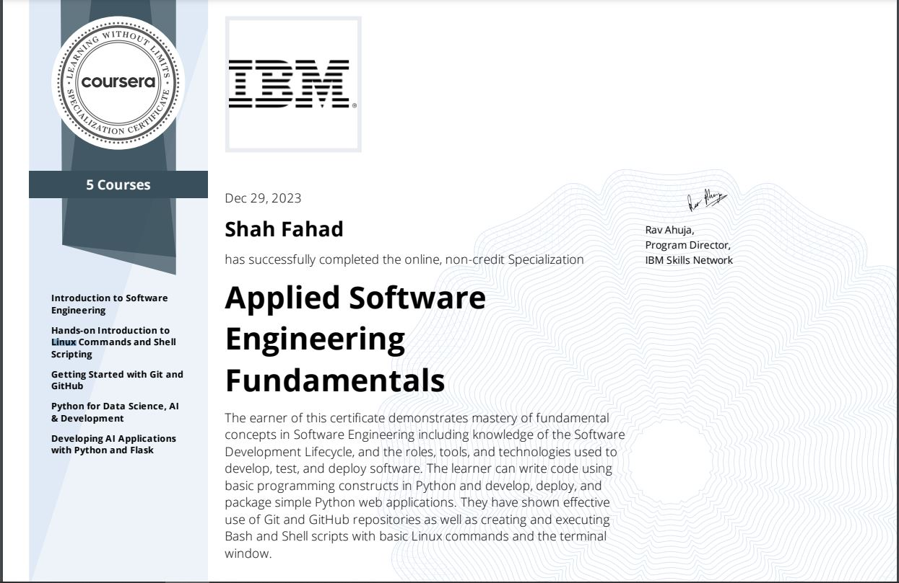

**Applied Software Engineering Fundamentals**

If you're eager to step into the dynamic realm of software development, the Software Engineering Foundations Specialization by IBM is tailored for you. No prior degrees or programming knowledge are required. With Software Developers in high demand, earning a median salary of $110,140 per year, the field is growing at a rate of 22%, making it an opportune time to launch a career in software engineering. This self-paced program equips you with foundational skills for various IT and software development roles, spanning web and mobile application development, front-end, back-end, full-stack application development, software testing and quality assurance (QA), and DevOps engineering.

The specialization offers engaging videos, hands-on labs, and real-world projects covering fundamental programming principles, design and architecture foundations, the software development lifecycle, Git and GitHub repositories, Linux terminal usage, Bash shell scripting for automation, and coding in Python. Whether you're new to software engineering or seeking a review of fundamentals, this program provides an introduction to the culture, technology, and job-ready skills essential for success in software engineering.

---

**Courses in the Specialization:**

1. [Introduction to Software Engineering](https://coursera.org/share/904caad986debaaf4c56be3e7559f3fe)
2. [Hands-on Introduction to Linux Commands and Shell Scripting](https://coursera.org/share/141790d617475bc5671547799d4ea65f)
3. [Other Courses in this Specialization](https://coursera.org/share/7a858edc87e0bb9584c9974e0a6ac48d)

**Certificate: Applied Software Engineering Fundamentals**

---

**Other Courses:**

1. **Meta Front End Developer**

   - [Meta Front End Developer](https://github.com/ShahandFahad/Meta-Front-End-Developer.git)

2. **Meta Front End Developer Capstone**

   - [LittleLemon Using React](https://github.com/ShahandFahad/Little-Lemon.git)

3. **Meta Back End Developer**

   - [Meta Back End Developer](https://github.com/ShahandFahad/Meta-Back-End-Developer.git)

4. **Meta Back End Developer Capstone**

   - [LittleLemon Using Django and DRF](https://github.com/ShahandFahad/littlelemon.git)

5. **IBM Full Stack Software Developer**
   - [IBM-full-stack-software-developer](https://github.com/ShahandFahad/IBM-full-stack-software-developer.git)
